# Interview Assistant (proof of concept)

A second listener for structured interviews. It transcribes the conversation, tracks a checklist of topics, suggests follow-up questions while you talk, and drafts a report for you to review afterwards. Interview types are configuration files ("packs"): a child welfare (CPS) interview and a job interview are included.

**What it is not.** It assists the person doing the interview; it never decides. It never judges whether someone is telling the truth, never says whether abuse or anything else happened, and never rates a person. Every statement it shows rests on a quote from the transcript. **This is a proof of concept: do not use it with real case data.** All demo data, scripts and screenshots are fictional.

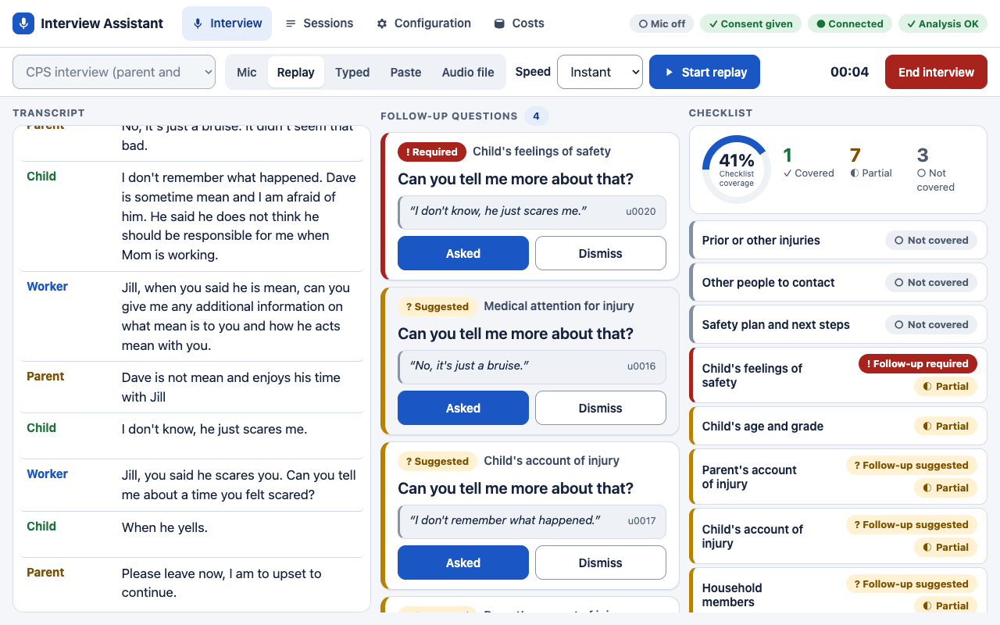

## Contents

**Part 1: Using the tool**
- [Pages](#pages)
- [One interview, start to finish](#one-interview-start-to-finish)
- [Speaker labels](#speaker-labels)
- [Review and report](#review-and-report)
- [Configuring an interview type](#configuring-an-interview-type)
- [Feature list](#feature-list)

**Part 2: Setup and extending**
- [Requirements and install](#requirements-and-install)
- [Run modes](#run-modes)
- [Settings](#settings)
- [Adding an interview type](#adding-an-interview-type)
- [Cost, latency and rate limits](#cost-latency-and-rate-limits)
- [Tests and evaluation scripts](#tests-and-evaluation-scripts)
- [Repo layout](#repo-layout)
- [Troubleshooting](#troubleshooting)
- [Limits and roadmap](#limits-and-roadmap)

---

# Part 1: Using the tool

## Pages

Every page has the same header: **Interview**, **Sessions**, **Configuration**, **Costs**.

| Page | URL | What it is for |
|---|---|---|
| Interview | `/` | The live screen: transcript, follow-up questions, flags, checklist, notes |
| Review | `/review/<session>` | After the interview: check the draft, accept / edit / reject, export the report |
| Configuration | `/config` | View or edit an interview type, test it, import a CatchUp template |
| Sessions | `/sessions` | Past interviews: open the review, the report or the JSON |
| Cost report | `/costs` | Model cost and latency per experiment and role, provider health |

The app runs on your own computer at `http://localhost:8000`.

## One interview, start to finish

1. **Choose the interview type** in the picker on the left of the toolbar, and an input mode (below). Opening the page does not start anything: the clock waits at 00:00 and nothing is recorded.

   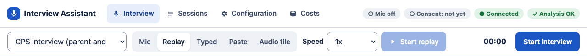

2. **Choose an input mode:**

   | Mode | What it does | Needs |
   |---|---|---|
   | Mic | Live speech to text from your microphone | AssemblyAI key |
   | Replay | Plays the interview type's fictional sample script (1x, 2x or instant) | nothing |
   | Typed | You type each line and pick who said it | nothing |
   | Paste | Paste a transcript (`Speaker: text` per line), map the names to roles, play it | nothing |
   | Audio file | Transcribes an mp3, wav or m4a at normal speed, as if live; "Play the audio here" plays it in the browser in step (for demos) | AssemblyAI key, ffmpeg |

   Then press **Start interview**. The clock starts, the input controls turn on, the interview type locks, and the button becomes **End interview**.

3. **Read the live screen.** The transcript is on the left. The checklist on the right shows each topic as *Not covered*, *Partial* or *Covered*, gaps first, with the checklist coverage ring on top. Tap a topic to see why and the quotes behind it; tap a quote to jump to that line in the transcript.

   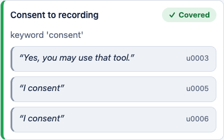

4. **Use the follow-up questions** in the middle column. A card is *Suggested* (useful) or *Required* (the interview type's rules say this must be followed up). Each card shows the line it responds to. Press **Asked** once you have asked it, or **Dismiss**. Flags (things worth noting, with their quote) appear under the cards.

   A *suggested* card waits until the answer is over (your next line, or a few seconds of silence), so it does not jump in while the person is still talking; if the rest of the answer covers the topic, no card appears. A card already showing is rewritten, marked **↻ Updated**, when later answers change what is missing. Required cards appear at once and stay at the top.

   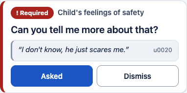

5. **Add notes** in the notes box under the checklist. Notes are yours: they go into the report as written.

6. **Consent prompt** (interview types with a consent topic, such as CPS): if someone seems to refuse recording, the tool asks you. **Stop the tool** ends transcription at once; **Continue** carries on.

   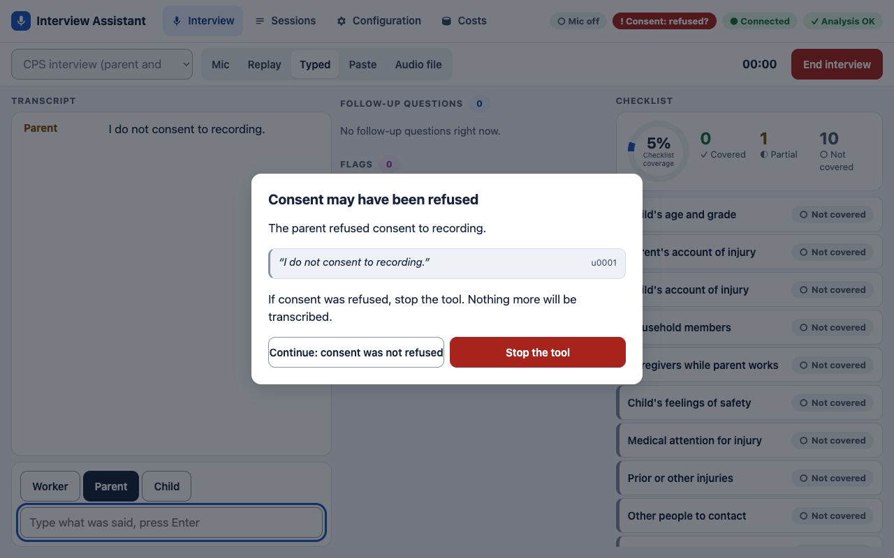

7. **"Before you leave"** opens when a line sounds like the interview is ending, and when you press **End interview**. It lists required topics still open. **Keep going** returns to the interview; **End interview** stops the tool and starts the review.

   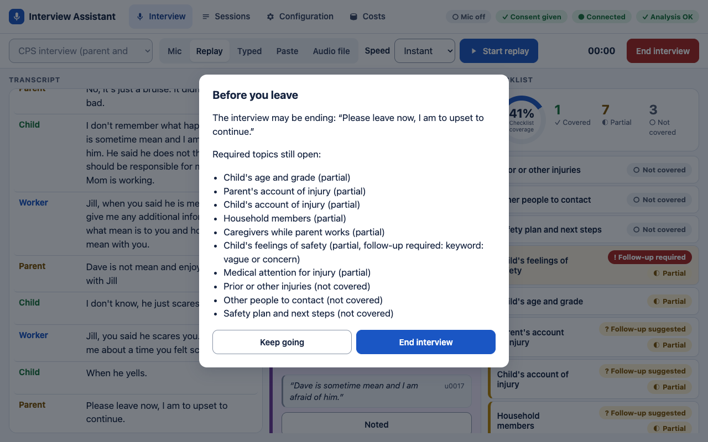

8. **Review the draft.** A banner links to the review page (or open it later from **Sessions**). See [Review and report](#review-and-report).

**If the page reloads** during an interview it reconnects to the same interview. If you were away more than 2 minutes, or the app restarted, the page says the interview could not be resumed and starts a new one. Leaving the page while an interview is running asks first.

The top bar shows the microphone, consent, connection and **Analysis** status. "⏳ Analysis delayed" means the model provider is slow or limiting requests and the checklist will catch up; "⚠ Analysis skipped for N lines" means some lines were not analysed live (the review still reads the whole transcript). See [rate limits](#rate-limits).

On a tablet the screen uses the same three columns in landscape, and two in portrait:

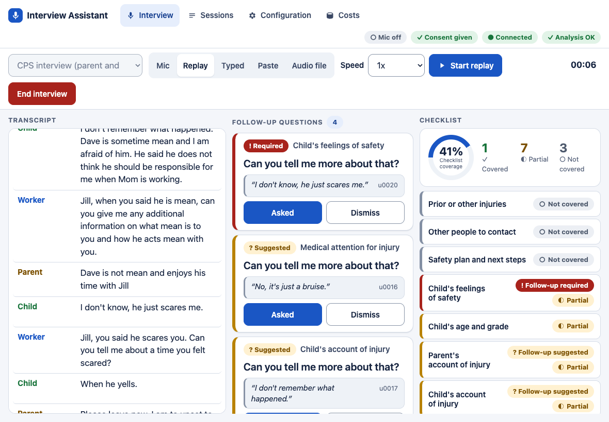

## Speaker labels

In Mic and Audio file mode, AssemblyAI labels voices **Voice A, B, C** in the order it hears them. Map each voice to a role (for example Voice A → Worker) in the panel under the transcript. New lines use the mapping, and earlier lines from that voice that still say Unknown take it too (the change is logged; lines that already have a role keep it).

When the labels are wrong (they can be, especially with similar voices or short answers):
- tap the **speaker name** on a line to correct that one line (a short answer straight after a question often gets the questioner's label); the change is logged, and the review uses it;
- use the **speaker toggle** (Auto / one button per role) to force the speaker of the lines that follow, then set it back to Auto;
- after a dropped connection AssemblyAI restarts its labels, so the mapping resets and the screen tells you to map again;
- very short turns (about a second, such as "I consent") may come back unlabelled and show as unknown;
- AssemblyAI ends a turn at a pause, not at a change of speaker, so a quick reply can land in the other person's turn. The tool splits such a turn where the per-word speaker labels change (a change of one or two words is treated as noise and not split).

In Paste mode, the tool matches names before the colon to roles (aliases such as "Mom" → Parent come from the interview type); you can change the mapping before pressing Play.

## Review and report

The review page opens with **checklist coverage** and one **topic card** per topic, gaps first.

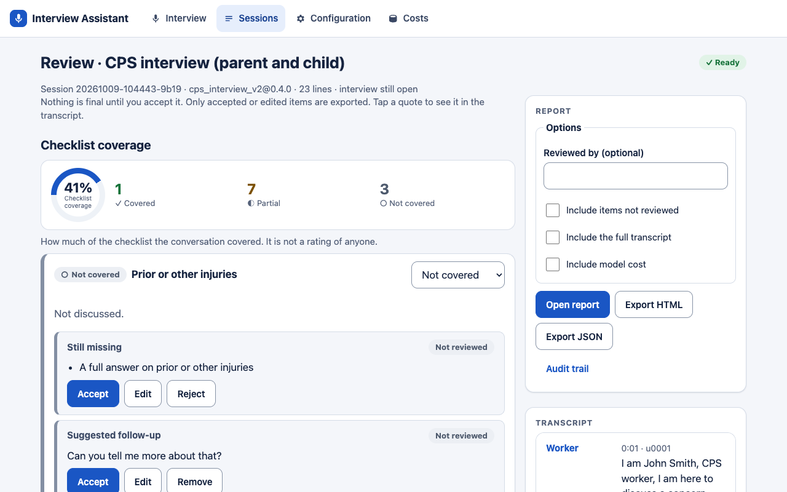

**Checklist coverage** is how much of the checklist the conversation covered: covered = 100, partial = 50, not covered = 0, averaged over required topics (optional topics are listed but not counted). It is computed in code from the topic statuses, not by a model. **It is not a score for any person** (candidate, parent, child or family) and not an assessment of the interview's quality. An interview type can show counts only (`review.show_coverage_score: false`).

**Topic cards.** Each card has the status, a short summary, what is still missing, a suggested follow-up and up to three quotes. The status comes from the live checklist; the review may change it only with a reason (and may raise it only with a quote), and you can set it yourself with the selector (marked "set by" you). Summary, missing and follow-up each have **Accept**, **Edit**, **Reject** (the follow-up: Remove).

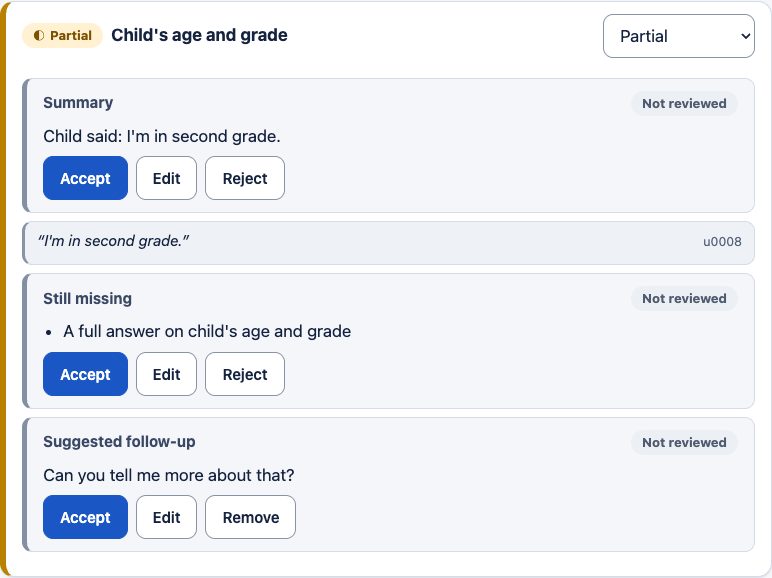

Below the cards are the other draft sections the interview type asks for (summary, next steps, custom sections, for CPS also the form fields, timeline and accounts side by side). Items about something that was *not* said show "Based on the checklist: <topic> (<status>)", plus the closest quote when there is one. Interview types that allow it (the job interview demo) add an overall assessment marked **"Draft for human review"**.

**What you control in the report** (the Report box on the right):

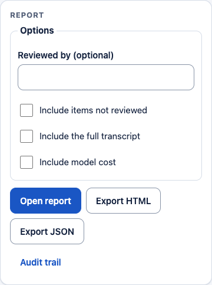

- Only what you **accepted or edited** goes in. Statuses, coverage and validated quotes are always included; your notes always are.
- **Reviewed by** (optional): your name in the banner; otherwise a generic "the <role>".
- **Include items not reviewed** (off by default): adds them, each marked "Not reviewed".
- **Include the full transcript** (off by default): adds it as an appendix.
- **Include model cost** (off by default).
- **Open report** shows it in the browser; **Export HTML** / **Export JSON** download it. Every export is logged in the audit trail and a copy is saved in the session folder.

**The HTML report** is one self-contained file: header (interview type, date, duration, roles), a banner saying it is an AI-assisted draft and whether it was reviewed, checklist coverage, topic cards (gaps open), the other sections, the overall assessment if any, notes and consent, the optional transcript, and a footer with the models used and the tool statement. Everything from the transcript or a model is escaped; the file makes **no network requests** (no fonts, scripts or images from elsewhere), so it opens offline. To make a PDF, open the report and use the browser's **Print → Save as PDF**: all topic cards open for printing and cards are not split across pages.

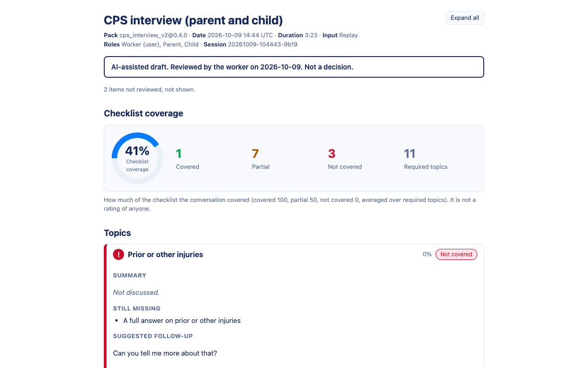

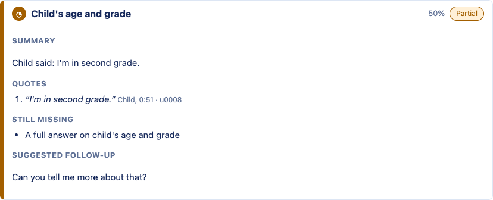

**Sample reports** (fictional data): [CPS sample](docs/sample_reports/cps_replay_sample.html) and [job interview sample](docs/sample_reports/job_interview_sample.html) made with the free offline models, and the same scripts run through the real models: [CPS](docs/sample_reports/cps_replay_sample_real_models.html), [job interview](docs/sample_reports/job_interview_sample_real_models.html). Download and open them in a browser. The offline samples show low coverage for the job interview because the offline demo checklist only recognises a few keywords.

**Sessions** lists every interview with its status (running, review ready, reviewed), duration, lines and cost:

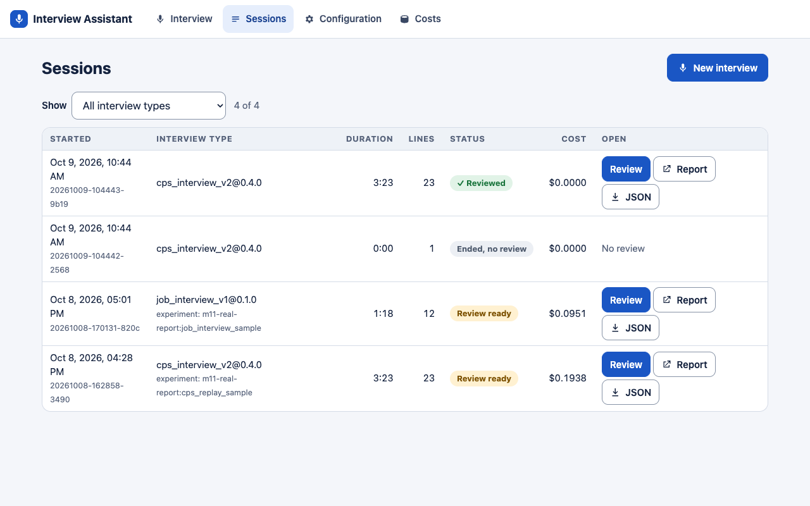

## Configuring an interview type

Open **Configuration**, choose an interview type and press **Edit**. You can change the name, purpose, focus areas, role names and which role uses the tool, and the topics: for each topic a **label**, **A complete answer includes** (one thing per line), **Follow up if** (optional; makes a follow-up *required*), and **required**. Each field has an (i) with help. Problems show beside the field as you type; Save stays off until there are none.

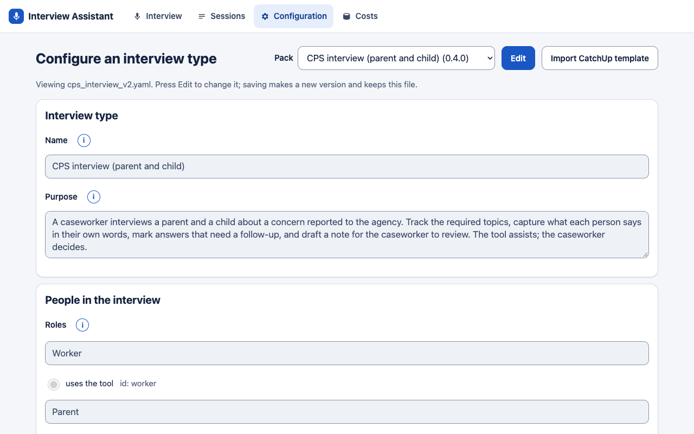

- **What the assistant watches for** has two lists. **Pay attention to** steers what the assistant notices but never raises anything on its own. **Raise a flag when** lists situations that must produce a flag card during the interview (one per line; "Add a common rule" offers a few generic ones). Above them, locked, are the flags every interview type always gets: a concern for someone's safety, two accounts of the same event that differ, and refused consent where the type has a consent topic. **Test this template** lists the flags the sample raised, with their quotes.
- **Advanced** sections are collapsed. Per topic: a full definition and invented examples. For the whole interview type (read-only here): guardrails, special topics, review sections, form fields, prompts.
- **Test this template** replays a sample transcript with your (unsaved) changes and shows the checklist result. Offline models are free; **Run with real models** shows a cost estimate first and runs only after you confirm.
- **Save as new version** writes a new file and keeps the original. An interview already running keeps the version it started with; the Interview page's picker shows the new one without a restart.
- **Import CatchUp template** reads a CatchUpAI JSON template, shows the importer's warnings, and opens the result for editing.

## Feature list

**Live, during the interview**
- Transcript with speaker names and colours from the interview type; tap a line to see the checklist topics it supports.
- Checklist with *Not covered / Partial / Covered*, gaps first, coverage ring, and the quotes behind each status.
- Follow-up levels: *Suggested* (vague, evasive, incomplete or contradictory answers, for every interview type) and *Required* (the type's own rules, such as a child saying they feel unsafe).
- Follow-up cards with the line they respond to; Asked / Dismiss; every question is checked to be open-ended and free of leading or blocked words before it is shown.
- Flags with their quote: built-in ones (safety concerns, accounts that differ, refused consent) plus the interview type's own "Raise a flag when" rules; notes you type.
- Consent prompt and "Before you leave" prompt (open required topics).
- Five input modes: Mic, Replay (1x, 2x, instant), Typed, Paste, Audio file.
- Nothing starts until you press Start interview. Reload-safe: a reload reconnects to the same interview; leaving mid-interview asks first.
- Analysis status: delayed or skipped analysis is always shown, never silent.

**After the interview**
- Review page: checklist coverage, topic summaries (summary, missing, follow-up, quotes), status override, accept / edit / reject for every model-written part, quotes linked to the transcript.
- Draft sections set by the interview type, including custom sections imported from CatchUp; the overall assessment ("Draft for human review") only where the type allows it.
- HTML report (self-contained, offline, printable) and JSON export, containing only what you accepted or edited unless you choose otherwise.
- Sample reports with fictional data in `docs/sample_reports/`.

**Configuration**
- Interview types as YAML packs; picker on the Interview page.
- Configuration page: tier 1 editing with help and live validation, Advanced collapsed, test with offline or real models, save as a new version.
- CatchUpAI template import (page or command line).

**Records**
- Audit log per session (every AI output shown, every decision, every export), cost ledger per call, Sessions page, Cost report page and command-line report, per-session spending cap.

---

# Part 2: Setup and extending

## Requirements and install

- Python **3.12** (the version tested; the macOS system Python 3.9 is too old).
- [uv](https://docs.astral.sh/uv/) to create the environment (or use `python3.12 -m venv` and pip).
- **ffmpeg** for Audio file mode only (`brew install ffmpeg`). The app starts without it and says so.
- A recent Chrome, Edge, Safari or Firefox.

```bash
cd voicenotes-poc
uv venv --python 3.12 .venv
uv pip install --python .venv/bin/python -r requirements-dev.txt   # app + test tools; requirements.txt is the app only
cp .env.example .env                                               # then add keys (below); never commit .env
```

**Keys** go in `.env` only (it is git-ignored; the app never prints them):

| Key | Needed for | Without it |
|---|---|---|
| `OPENROUTER_API_KEY` | Real models: checklist, follow-up cards, review | Those features are off (the screen says why); offline models still work |
| `ASSEMBLYAI_API_KEY` | Mic and Audio file modes | Those modes say the key is missing |
| `OPENAI_API_KEY`, `GOOGLE_API_KEY` | Nothing yet (reserved) | — |

Some files are deliberately not in the repo (keys, past sessions, test recordings). [docs/dev-notes/LOCAL-DATA.md](docs/dev-notes/LOCAL-DATA.md) lists them and says where to put them if a teammate sends you a copy.

Check what the app sees: `curl http://localhost:8000/health` lists the interview type, gate model, which keys are present (true / false, never the values) and whether ffmpeg was found.

## Run modes

**1. Free offline demo** (no keys, no cost). Offline models stand in for the real ones: a keyword checklist, template follow-up questions and a template review built from quotes.

```bash
GATE_MODEL=fake:keyword CUE_MODEL=fake:template REVIEW_MODEL=fake:template \
  .venv/bin/python -m uvicorn app.main:app
```

Open http://localhost:8000, choose **Replay**, speed **Instant**, press **Start interview**, then **Start replay**. The CPS sample ends with a line that opens "Before you leave"; press **End interview** there, then **Open the review** in the banner. To try the job interview, pick "Job interview" in the picker first; its sample does not end that way, so press **End interview** in the toolbar when the replay stops.

**2. Real models** (paid; needs `OPENROUTER_API_KEY`, and `ASSEMBLYAI_API_KEY` for Mic or Audio file):

```bash
.venv/bin/python -m uvicorn app.main:app
```

Spending per session is capped by `max_session_cost_usd` (default $1.00): when a session reaches it, model calls stop and the screen says so.

Any setting can be overridden for one run with an environment variable (upper case name), for example `EXPERIMENT_LABEL=try-1` or `GATE_ADAPTER=hybrid`; model roles use `<ROLE>_MODEL` (`GATE_MODEL`, `CUE_MODEL`, `REVIEW_MODEL`, `STT_MODEL`).

## Settings

`config/settings.yaml` holds the settings. **Override order** (later wins): `settings.yaml`, then `.env`, then environment variables.

| Setting | Default | What it does |
|---|---|---|
| `models.stt` | `assemblyai:universal-3-6-pro` | Speech to text (`universal-streaming-english` is cheaper) |
| `models.gate` | `openrouter:google/gemini-3.8-flash` | The checklist model, run after each line. `fake:keyword` = offline |
| `models.cue` | `openrouter:google/gemini-3.8-flash` | Writes follow-up questions. `fake:template` = offline |
| `models.review` | `openrouter:anthropic/claude-sonnet-5.5` | Writes the post-interview draft. `fake:template` = offline |
| `gate_adapter` | `llm` | `llm`; `hybrid` (a fast small classifier marks "topic came up" early, the gate model decides everything); `jev` (experiment only) |
| `hybrid_min_confidence` | `0.9` | Hybrid: confidence needed for the early mark |
| `gate_prompt` | `full` | `full` or `short` (shorter prompt; no latency gain measured) |
| `gate_temperature` | `null` | `null` = provider default (Google recommends 1.0 for Gemini 3) |
| `jev_model`, `jev_min_probability`, `jev_questions`, `jev_followup_probability` | see file | Jev and hybrid gate experiments |
| `experiment_label` | `default` | Tags every cost row so runs can be compared; also settable on the live screen before the first model call |
| `window_utterances` | `12` | Most lines sent to the gate in one run |
| `cue_cooldown_seconds` | `60` | Wait before a dismissed or asked follow-up can return without new evidence |
| `cue_hold_suggested` | `true` | A *suggested* card waits until the interviewee's answer is over (required cards never wait) |
| `cue_hold_s` | `4` | The answer counts as over at the interviewer's next line, or after this many seconds without a new line |
| `cue_reasoning_effort` | `minimal` | Reasoning effort sent to the cue model; `null` = not sent |
| `stt_speaker_labels` | `true` | Ask AssemblyAI for voice labels (adds $0.12 per hour) |
| `stt_max_speakers` | `3` | Most voices to label |
| `stt_split_turns` | `true` | Split a turn that holds two speakers where AssemblyAI's word-level labels change |
| `store_audio` | `false` | Keep the audio in the session folder (audited) |
| `max_session_cost_usd` | `1.00` | Spending cap per session |
| `limits.requests_per_min` | `openrouter: 18` | Requests per minute per model; key `provider` or `provider:model`; `0` = no limit |
| `limits.deadline_s` | gate 8, cue 8, review 60, batch 60 | Longest a call may take, waits and retries included |
| `limits.max_attempts` | `4` | Retries for rate limits, server errors and timeouts |
| `limits.backoff_start_s`, `limits.backoff_cap_s` | `1`, `8` | Wait between retries (doubling, capped) |
| `pack` | `packs/cps_interview_v2.yaml` | The interview type selected when the page opens |

**Settings inside an interview type** (pack file), two worth knowing:
- `review.show_coverage_score` (default `true`): `false` shows the coverage counts and statuses without the number, on screen, in the HTML and in the JSON.
- `guardrails.allow_overall_recommendation` (default `false`): adds an overall assessment ("Draft for human review": strengths and gaps per topic, each with a quote, then a short draft view) to the review only, never during the interview. The job interview demo has it on; the CPS packs have it off. **Demo only:** not for real hiring or case decisions. Using it on real child welfare cases would need the owner's and the agency's approval.

## Adding an interview type

An interview type is one YAML file in `packs/`. The fastest ways:

- **From the Configuration page:** pick an existing type, Edit, change it, Save as new version.
- **Copy a file:** copy `tests/packs/tiny_pack.yaml` (the smallest valid pack) into `packs/`, change `id`, `name`, roles and topics, and reload the Interview page.
- **Import a CatchUpAI template:**

  ```bash
  .venv/bin/python -m app.import_template tests/catchup_templates/all_section_types.json --out packs/my_type.yaml
  ```

  It never overwrites a file, validates the result, and always warns that the first speaker became the role using the tool: check that.

The loader validates every pack at start-up and on save; a pack with problems is refused with a plain message naming the field.

**Pack format** (tier 1 is all a manager needs; everything under tier 2 is optional):

```yaml
id: garden_club_intake          # lower case, digits, underscores
version: "0.1.0"
pack_format: 2
name: Garden club intake        # shown in the picker
purpose: >                      # one paragraph; goes into every prompt
  A volunteer coordinator talks to a new member of a community garden.
pay_attention_to: []            # optional focus areas, one per line (steer only)
flag_when:                      # optional: situations that must raise a flag card, one per line
  - The member mentions a health condition that affects what they can do
roles:                          # exactly one "user" (the person using the tool), at least one "subject"
  - {id: host, label: Coordinator, kind: user}
  - {id: guest, label: New member, kind: subject, aliases: [member]}   # aliases: names matched in Paste mode
sample_script: tests/fixtures/tiny_sample.json   # optional: enables Replay for this type
checklist:
  - label: Availability         # id is generated from the label if omitted
    criteria:                   # "A complete answer includes", one thing per line
      - How often the member can help
      - Which days suit them
    follow_up_when: The member gives no days or times at all   # optional: makes the follow-up *required*
    required: true              # default true; optional topics are left out of the coverage score
    # tier 2 (optional):
    # definition: full rules in prose; replaces the generated "Complete when all of: ..." text
    # examples: [invented examples only, never lines from a real or test interview]
    # demo: {keywords: [...]}   # words the offline keyword checklist looks for
# tier 2, whole pack (optional; generic defaults apply when absent):
# guardrails: prompt_rules, question_lint {open_ended_only, blocked_terms, act_terms, name_with_act_rule},
#             note_blocked_patterns, follow_up_required_when, allow_overall_recommendation,
#             overall_assessment_instruction
# special_topics: {consent_topic: <topic id>, audience_hint_topic: <topic id>, audience_hint_instruction: ...}
# ending_phrases: [...]          # lines that open "Before you leave"
# review: {sections: [summary, topics_not_covered, follow_ups, form, timeline, accounts, missing_accounts, next_steps],
#          custom_sections: [{id, label, type: text|list|status|boolean|score, instruction, required, ...}],
#          instructions: {...}, extra_sources: [...], account_groups: [...], show_coverage_score: true}
# form_schema: [{id, label, type: text|choice|date|number, choices, source_topic_ids}]
```

`packs/cps_interview_v2.yaml` uses every tier 2 option; `packs/job_interview_v1.yaml` shows hiring guardrails and custom review sections. Whatever the pack says, these rules stay in code for every type: the tool assists only, transcript text is treated as data and never as instructions, every statement needs a quote that is found in the transcript, no credibility judgements, no conclusions about people.

Pack text rules for this repo: definitions come from experts or policy, never from a test line; examples are invented; every change gets a line in the pack change log in [docs/dev-notes/PROGRESS.md](docs/dev-notes/PROGRESS.md). A test fails if a pack shares six or more consecutive words with a test transcript.

## Cost, latency and rate limits

Every model and speech call writes a row to the session's `ledger.jsonl`. Read it with the **Costs** page or the command line:

```bash
.venv/bin/python -m app.report                     # per experiment and role: calls, failures, cost, p50 / p95
.venv/bin/python -m app.report --experiment try-1 --csv out.csv
.venv/bin/python -m app.report --health            # per session: HTTP 429s, retries, waits, skipped runs
```

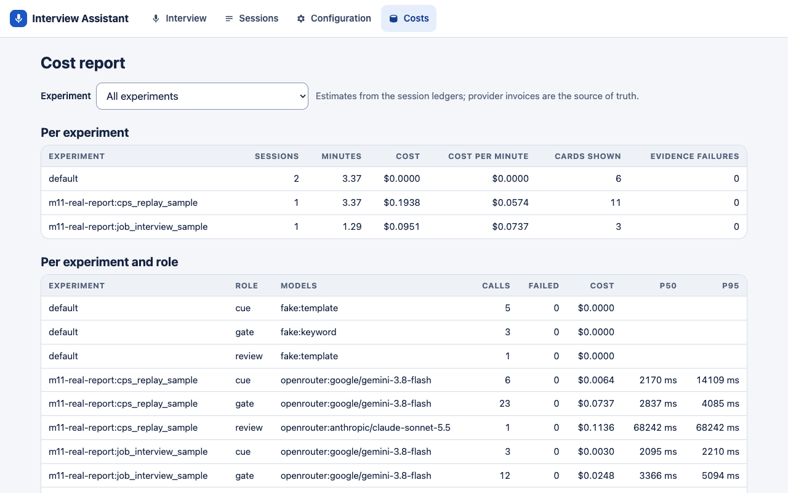

Offline (fake) model calls cost nothing and the command-line report leaves them out, so after offline runs only it prints "(no rows)". The ledger is an estimate from token counts and `config/prices.json`; the provider's invoice is the source of truth. **To compare two configurations**, run each with its own `experiment_label` (for example `EXPERIMENT_LABEL=gate-a`), then compare the rows on the Costs page or with `--experiment`.

**Measured in this repo** (ledger, 2026-10-08; fictional scripts unless noted):

| Run | Result |
|---|---|
| CPS sample script (23 lines), real models, one line at a time | Checklist 23 calls, $0.074, p50 2.8 s per update; 6 follow-up cards, p50 2.2 s; review 68 s, $0.114; total $0.19 |
| Job interview sample script (12 lines), real models | Total $0.09 (checklist $0.025, review $0.063) |
| Job interview audio, 6 min 11 s, owner-supplied (not in the docs) | Speech $0.059, checklist $0.076 (p50 2.7 s), cards $0.005, review $0.093 (45-49 s): about $0.23 |
| Follow-up card delay from the end of a turn (CPS script) | 2.4-8.3 s (target 3-4 s; not met on long lines) |

Single slow calls happen: individual checklist calls took 14-15 s on 2026-10-08, and one whole run had a 14 s median that day.

### Rate limits

OpenRouter limited a new account to **20 requests per minute per model** (observed 2026-10-08, `docs/provider-notes.md`; not in OpenRouter's published docs). The tool therefore paces its own calls: `limits.requests_per_min` (default 18 per model) queues calls before they are sent, live follow-ups and the checklist first, the review next, test runs last. If the provider still answers "rate limited" or fails, the call is retried with a wait until its deadline.

- **"⏳ Analysis delayed (~N s)"**: a call is waiting for a request slot or a retry. Nothing is lost; lines that arrive meanwhile are analysed in the next run.
- **"⚠ Analysis skipped for N lines"**: the provider gave up within the deadline. Those lines were not analysed live; the review says which ones and reads the whole transcript anyway.

**What to do:** lower `limits.requests_per_min` if you still see 429s (`app.report --health` counts them); add credits or ask the provider to raise the limit; or route a model to another key or provider. Several people sharing one key share one limit.

## Tests and evaluation scripts

```bash
.venv/bin/python -m pytest -q
```

All tests are **offline and free** (fake models, fictional fixtures). The browser tests (`tests/test_ui_pages.py`, the offline report check) need Playwright's Chromium once: `.venv/bin/python -m playwright install chromium`; without it they are skipped. Audio file tests are skipped without ffmpeg.

Other offline tools (free):

| Command | What it does |
|---|---|
| `python -m tests.make_sample_reports` | Rebuilds the offline sample reports in `docs/sample_reports/` |
| `python -m tests.make_screenshots --costs-from sessions/<id> ...` | Rebuilds `docs/screenshots/` (fake models, fictional script; `--costs-from` copies saved sessions so the Costs page has rows) |
| `python -m tests.screenshot_pages <dir>` | Every page at laptop and tablet sizes, light and dark |
| `python -m tests.check_ui_basics` | Colour contrast of the design tokens and 44 px touch targets on every page |
| `python -m app.golden` | Scores saved CPS runs against the answer key (no model calls) |
| `python -m app.report` | Cost and latency report |

Paid scripts (real models; run only on purpose, they print their cost): `tests.smoke_gate`, `tests.smoke_cues`, `tests.smoke_review`, `tests.smoke_mic`, `tests.smoke_audio_file`, `tests.compare_gates`, `tests.compare_cues`, `tests.eval_job_audio`, `tests.check_limiter`, `tests.make_real_reports`, `tests.measure_review_drops`. Each file's first line says what it does and roughly what it costs. Run them as `.venv/bin/python -m tests.<name>`.

## Repo layout

```
app/                 server: FastAPI app (main.py), session loop (pipeline.py), review, report export, lints, ledger, audit
app/adapters/        speech to text (AssemblyAI, replay, typed), checklist gate, cue and review models, OpenRouter client
app/static/          the pages: HTML, CSS (tokens, components, pages), plain JavaScript; no build step
config/              settings.yaml, prices.json
packs/               interview types (YAML)
tests/               offline tests, fixtures (fictional scripts), paid scripts, screenshot and report makers
docs/                provider notes, sample reports, screenshots, design decisions
sessions/            one folder per interview: transcript, events, audit log, ledger, draft, report (git-ignored)
```

Background: [docs/dev-notes/PROGRESS.md](docs/dev-notes/PROGRESS.md) is the build log (what was built, measured and decided, milestone by milestone, and the pack change log); [docs/dev-notes/checks.md](docs/dev-notes/checks.md) the acceptance checks per milestone; [docs/dev-notes/LOCAL-DATA.md](docs/dev-notes/LOCAL-DATA.md) what is not in the repo and where it goes; [docs/design-decisions-vs-catchup.md](docs/design-decisions-vs-catchup.md) where this tool differs from CatchUpAI and why. The dev notes refer to the original spec documents, which are not in the repo.

## Troubleshooting

| Problem | What to do |
|---|---|
| "✕ Checklist off" or "✕ Cues off" (hover for the reason, often a missing `OPENROUTER_API_KEY`) | Add the key to `.env` and restart, or run the offline demo |
| Mic or Audio file: "ASSEMBLYAI_API_KEY is not set" | Add the key to `.env` and restart |
| Audio file: "ffmpeg missing" | Install ffmpeg (`brew install ffmpeg`) and restart; `/health` shows `"ffmpeg": true` |
| Microphone does not start | Use `http://localhost:8000` (browsers allow the mic only on localhost or https); allow the microphone in the browser's site settings |
| Speaker labels wrong | Remap Voice A/B/C, or use the speaker toggle; see [Speaker labels](#speaker-labels) |
| "Analysis delayed" / "Analysis skipped" | See [rate limits](#rate-limits); `python -m app.report --health` shows 429s and waits |
| "Session cost ... passed the cap ... Paid calls are stopped" | The session hit `max_session_cost_usd`; start a new interview or raise the cap |
| The page says the interview could not be resumed | The app restarted or you were away over 2 minutes; the old interview is under Sessions |
| `python3` is 3.9 | Use the `.venv` created with `uv venv --python 3.12` |

## Limits and roadmap

**Known limits**
- **Coverage is topic-level only.** Each topic is covered, partial or not covered; there is no status per criterion yet (the topic card has room for it). The coverage score is progress through the checklist, not an assessment of anyone or of the interview.
- The CPS definitions were tuned on one fictional script; the answer key has not yet been reviewed by a subject expert. The tier 1 ("simple") CPS pack missed a required safety follow-up that the full pack caught ([dev notes](docs/dev-notes/PROGRESS.md), M10).
- Speaker labels from AssemblyAI can be wrong. Turns that mix two speakers are split on the per-word labels, but only as well as those labels are right; a quote may then be attributed to the wrong person.
- Follow-up cards arrive 2.4-8.3 s after a turn in measured runs; the target is 3-4 s.
- One interview per browser tab; a reload reconnects only within 2 minutes; audio spoken while disconnected is lost.
- No sign-in, no deployment, local files only.

**Not built (roadmap):** Salesforce case context, PolicyBot, local speech to text and on-device models, court affidavits, drafting topics from an uploaded document, per-criterion status, PDF made by the server (use the browser's print).
